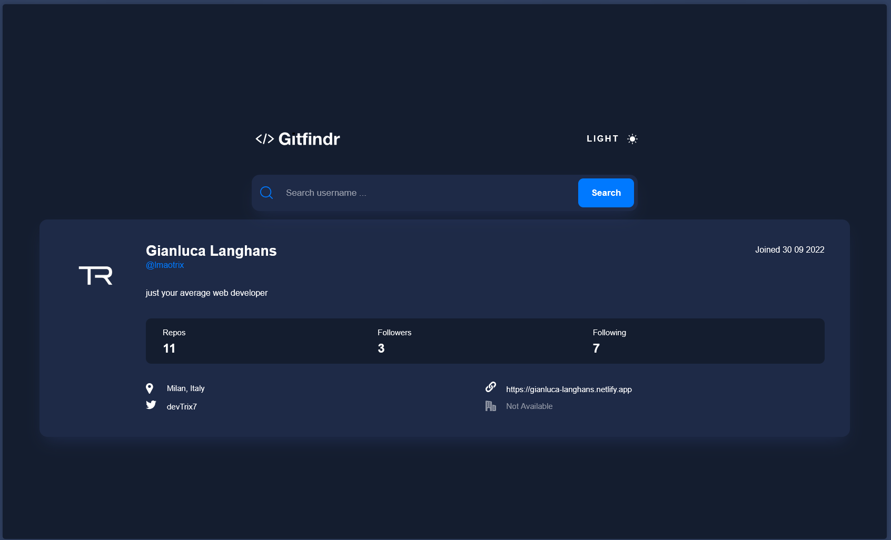
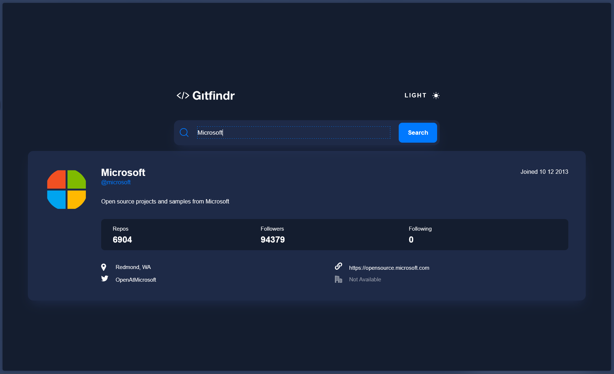

# GitFindr

Gitfindr is a modern web app built with Vite, React, and Typescript that allows users to search and preview GitHub profiles with ease. It fetches real-time data from the Github API and displays user information in a clean, responsive UI.



---

## 🚀 Features

- 🔍 Search GitHub users by username
- 👤 Display user details (bio, location, followers, etc.)
- 💡 Dark/light theme support
- ⚡ Built with Vite for lightning-fast performance

--- 

## 🛠️ Tech Stack

- **Frontend**: React + Typescript
- **Styling**: styled-components
- **API**: Github API
- **Bundler**: Vite

---

## 📦 Installation

### Prerequisites

- Node.js
- npm

### Clone the repo

```bash
git clone https://github.com/lmaotrix/Gitfindr.git
cd Gitfindr
```
### Install dependencies
```bash
npm install
```
### Run the development server
```bash
npm run dev
```
---

## 📁 Project Structure

```bash
Gitfindr/
├── public/
│   └── assets/
├── src/
│   ├── components/
│   ├── contexts/
│   ├── types/
│   ├── utils/
│   ├── App.tsx
│   ├── index.ts
│   └── main.tsx
├── .gitignore
├── index.html
├── package.json
└── vite.config.ts
```

## 📸 Screenshots
 



---


If you have any feedback, please reach out to us at coco.gian07@gmail.com
- gian.langhans (instagram)
- lmaotrix (discord)
- https://gianluca-langhans.netlify.app

